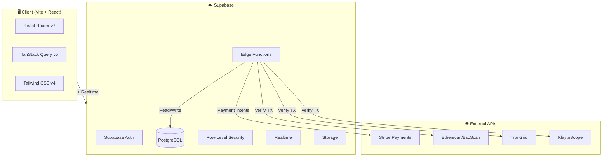

# 🛡️ RaidStore

> A premium gaming marketplace with middleman verification, crypto payments, in-app chat, and escrow-protected trading.

[](https://react.dev/)
[](https://www.typescriptlang.org/)
[](https://vite.dev/)
[](https://supabase.com/)
[](https://tailwindcss.com/)
[](https://tanstack.com/query)
[](https://vitest.dev/)
[](LICENSE)

---

## 📖 Table of Contents

- [Features](#-features)
- [Architecture](#-architecture)
- [Tech Stack](#-tech-stack)
- [Project Structure](#-project-structure)
- [Getting Started](#-getting-started)
- [Environment Variables](#-environment-variables)
- [Database](#-database)
- [Edge Functions](#-edge-functions)
- [Security](#-security)
- [Testing](#-testing)
- [Deployment](#-deployment)
- [License](#-license)

---

## ✨ Features

### 💎 Crypto Payments
| Feature | Description |
|---|---|
| 🪙 **138 Coins** | BTC, ETH, USDC, USDT, SOL, and 130+ more across 4 networks |
| 🔗 **Multi-Network** | Ethereum, BSC, TRON, Klaytn with auto-detection |
| 🏦 **Binance Rails** | Direct wallet-to-wallet deposits via Binance addresses |
| 🔍 **Blockchain Verification** | Etherscan/BscScan/TronGrid/KlaytnScope tx verification |
| 📋 **Binance-Style UI** | 3-step deposit: Select Coin → Network → Deposit |
| 🧪 **Test Mode** | Skip blockchain verification for development |

### 💬 In-App Chat (Facebook-Style)
| Feature | Description |
|---|---|
| 💬 **Direct Messages** | Buyer ↔ Seller, Seller ↔ Seller with real-time messaging |
| 👥 **Group Chats** | Middleman creates group with buyer + seller per transaction |
| 🏷️ **Role Badges** | `[SELLER]`, `[ADMIN]`, `[MIDDLEMAN]` visible in chat UI |
| 🎨 **Premium UI** | Gradient headers, slide-up animations, avatar support |
| ⚡ **Realtime** | Supabase Realtime via Postgres LISTEN/NOTIFY |
| 📌 **Multi-Dock** | Open multiple conversations, minimize, close independently |

### 🛒 Marketplace
| Feature | Description |
|---|---|
| 🎮 **Browse & Search** | Filter by game, platform, risk rating, price range, listing type |
| 🛡️ **Middleman Verification** | Live middlemen verify trades in group chats |
| 💳 **Escrow Payments** | Crypto/stripe payments secured by middleman escrow |
| 📸 **Screenshots** | Up to 15 screenshots per listing with lightbox viewer |
| 🏷️ **Dynamic Categories** | Auto-populated game + platform filters from active listings |
| 📦 **Stock Tracking** | Inventory count with auto-deduction on purchase |

### 👥 Role-Based Dashboards

| Role | Features |
|---|---|
| 👤 **Buyer** | Browse, purchase via crypto, chat with seller, transaction history |
| 💰 **Seller** | Revenue KPIs, listings CRUD, sales table, wallet, withdrawals |
| ⚖️ **Middleman** | Active/History queue, group chat creation, step-by-step verification, auto-assignment via DB trigger |
| 🛡️ **Admin** | User management, transaction editing, listing control, admin-only RPCs |

### 💵 Wallet & Withdrawals
| Feature | Description |
|---|---|
| 🏦 **Ledger System** | Immutable double-entry ledger — every transaction is recorded |
| 📤 **Withdraw** | Select completed sales → choose GCash/Maya/Bank Transfer → confirm |
| 📜 **History** | Expandable withdrawal batches with per-sale breakdown |
| 🔒 **Server-Side** | RPC validates `auth.uid()`, row locks prevent double-withdrawal |

### 🎨 Platform
| Feature | Description |
|---|---|
| 🌙 **Dark Mode** | System-preference detection, localStorage persistence |
| 📱 **Responsive** | Mobile-first across all 13 pages |
| 🔐 **Auth** | Supabase Auth with email/password, auto-refresh, session persistence |
| ⭐ **Reviews** | 5-star ratings + text reviews for completed transactions |
| 🧪 **Testing** | 116 tests across 10 files (Vitest + Testing Library) |

---

## 🏗 Architecture



---

## 🛠️ Tech Stack

| Layer | Technology |
|---|---|
| **Framework** | React 19 with TypeScript 5.7 |
| **Build** | Vite 8 (`rolldown` for production) |
| **Styling** | Tailwind CSS v4 with custom animations |
| **State** | TanStack Query v5 (`staleTime: 0`, `refetchOnMount: true`) |
| **Routing** | React Router v7 |
| **Auth** | Supabase Auth (email/password, auto-refresh tokens) |
| **Database** | PostgreSQL 15 via Supabase (RLS, triggers, RPCs) |
| **Realtime** | Supabase Realtime (`supabase.channel()`) |
| **Payments** | Stripe + Crypto via Edge Functions |
| **Icons** | Lucide React |
| **Testing** | Vitest + @testing-library/react + jsdom |
| **Linting** | ESLint + typescript-eslint |

---

## 📁 Project Structure

```
raidstore/
├── src/
│   ├── components/           # Reusable UI components
│   │   ├── ChatPanel.tsx          # Facebook-style chat dock
│   │   ├── CryptoCheckout.tsx     # 138-coin Binance-style deposit
│   │   ├── Layout.tsx             # App shell (nav, footer, chat dock)
│   │   ├── ListingCard.tsx        # Listing card with risk badge
│   │   ├── ProtectedRoute.tsx     # Role-based route guards
│   │   ├── StarRating.tsx         # Interactive 5-star component
│   │   ├── StripeCheckout.tsx     # Stripe payment flow
│   │   ├── WithdrawalHistory.tsx  # Expandable withdrawal batches
│   │   └── WithdrawalPanel.tsx    # Withdrawal creation UI
│   │
│   ├── contexts/             # React Context providers
│   │   ├── AuthContext.tsx        # Auth state, sign in/up/out
│   │   ├── ChatContext.tsx        # Multi-conversation state
│   │   ├── SearchContext.tsx      # Cross-page search state
│   │   └── ThemeContext.tsx       # Dark/light mode
│   │
│   ├── hooks/                # Custom React hooks
│   │   ├── useDebounce.ts         # Debounced value hook
│   │   ├── useGameCategories.ts   # Dynamic game filter options
│   │   ├── useListings.ts         # Listing queries + mutations
│   │   ├── useNotifications.ts    # Realtime status updates
│   │   ├── useOnlineStatus.ts     # Network connectivity
│   │   ├── usePlatforms.ts        # Dynamic platform filters
│   │   ├── useRealtimeTransaction.ts  # Realtime tx status
│   │   ├── useReviews.ts          # Review CRUD
│   │   ├── useTransactions.ts     # Buyer/seller transactions
│   │   └── useWallet.ts           # Wallet balance + withdrawals
│   │
│   ├── lib/                  # Core utilities
│   │   ├── constants.ts          # App config, game lists, addresses
│   │   ├── database.types.ts     # Generated Supabase types
│   │   ├── supabase.ts           # Supabase client + helpers
│   │   ├── types.ts              # TypeScript interfaces
│   │   └── utils.ts              # Formatting, helpers, initials
│   │
│   ├── pages/                # Route-level page components
│   │   ├── AdminDashboard.tsx     # Admin: users, transactions, listings
│   │   ├── BrowseListings.tsx     # Public marketplace browse
│   │   ├── CreateListing.tsx      # Seller listing creation
│   │   ├── Dashboard.tsx          # Role-based home (buyer/seller/middleman)
│   │   ├── ListingDetail.tsx      # Listing view + purchase flow
│   │   ├── Login.tsx              # Auth page
│   │   ├── MiddlemanDashboard.tsx # Middleman queue + verification
│   │   ├── MyListingsView.tsx     # Seller listing management
│   │   ├── PrivacyPolicy.tsx      # Privacy policy page
│   │   ├── Profile.tsx            # User profile + role management
│   │   ├── SetupProfile.tsx       # Post-registration onboarding
│   │   ├── TermsOfService.tsx     # Terms of service page
│   │   └── TransactionView.tsx    # Transaction detail + chat
│   │
│   ├── App.tsx               # Route definitions
│   ├── main.tsx              # Entry point
│   └── index.css             # Tailwind + custom styles
│
├── supabase/
│   ├── functions/            # Deno Edge Functions
│   │   ├── create-payment-intent/   # Stripe PaymentIntent
│   │   ├── handle-payment-success/  # Stripe webhook handler
│   │   ├── refund-transaction/      # Stripe refund
│   │   ├── release-escrow/          # Escrow → seller wallet
│   │   └── verify-crypto-payment/   # Blockchain tx verification
│   │
│   ├── migrations/           # 21 SQL migration files
│   └── config.toml           # Supabase CLI config
│
├── .env.example             # Environment variable template
├── .gitignore
├── LICENSE                  # MIT
├── package.json
├── tsconfig.json
├── vite.config.ts           # Vite + path aliases
└── README.md
```

---

## 🚀 Getting Started

### Prerequisites

- **Node.js** 18+ 
- **npm** 9+
- **Supabase** account ([supabase.com](https://supabase.com))
- **Stripe** account (for payment features)
- **Etherscan API key** (for crypto verification)

### 1. Clone & Install

```bash
git clone https://github.com/jersanmd/global-accounts.git
cd global-accounts
npm install
```

### 2. Environment Setup

```bash
cp .env.example .env
```

Fill in your `.env` with real values (see [Environment Variables](#-environment-variables)).

### 3. Database Setup

Run all migrations in order via the **Supabase SQL Editor**:

1. Go to [supabase.com/dashboard](https://supabase.com/dashboard) → your project → SQL Editor
2. Run each `.sql` file in `supabase/migrations/` in numerical order (`00001` → `00021`)
3. Enable **Realtime** on the `messages` table for chat to work

### 4. Deploy Edge Functions

```bash
# Install Supabase CLI
npm install -g supabase

# Login
supabase login

# Link project
supabase link --project-ref YOUR_PROJECT_REF

# Deploy each function
supabase functions deploy create-payment-intent
supabase functions deploy handle-payment-success
supabase functions deploy refund-transaction
supabase functions deploy release-escrow
supabase functions deploy verify-crypto-payment

# Set secrets for each function
supabase secrets set STRIPE_SECRET_KEY=sk_test_... --project-ref YOUR_PROJECT_REF
supabase secrets set SUPABASE_SERVICE_ROLE_KEY=... --project-ref YOUR_PROJECT_REF
```

### 5. Run Dev Server

```bash
npm run dev
# → http://localhost:5173
```

---

## 🔐 Environment Variables

| Variable | Required | Description |
|---|---|---|
| `VITE_SUPABASE_URL` | ✅ | Supabase project URL |
| `VITE_SUPABASE_ANON_KEY` | ✅ | Supabase anonymous key |
| `VITE_STRIPE_PUBLISHABLE_KEY` | — | Stripe publishable key |
| `STRIPE_SECRET_KEY` | — | Stripe secret (Edge Function env) |
| `STRIPE_WEBHOOK_SECRET` | — | Stripe webhook signing secret |
| `SUPABASE_SERVICE_ROLE_KEY` | — | Service role key (Edge Function env) |
| `VITE_PLATFORM_USDC_ADDRESS` | — | Your ETH USDC deposit address |
| `VITE_PLATFORM_BSC_ADDRESS` | — | Your BSC deposit address |
| `VITE_PLATFORM_TRON_ADDRESS` | — | Your TRON deposit address |
| `VITE_PLATFORM_KLAYTN_ADDRESS` | — | Your Klaytn deposit address |
| `VITE_PLATFORM_SOL_ADDRESS` | — | Your Solana deposit address |
| `VITE_PLATFORM_ICP_ADDRESS` | — | Your ICP deposit address |
| `VITE_ETHERSCAN_API_KEY` | — | Etherscan/BscScan API key |

---

## 🗄️ Database

### Migrations

All migrations are in `supabase/migrations/`. Run in numerical order:

| # | File | Description |
|---|---|---|
| 00001 | `initial_schema.sql` | Core tables: profiles, listings, transactions, reviews, notifications, credentials. RLS policies. Auth trigger. |
| 00002 | `seed_listings.sql` | Demo data: seed users, listings, and test transactions |
| 00003 | `add_last_seen.sql` | `last_seen` timestamp for online status |
| 00003 | `seed_related_listings.sql` | Additional seed data for related listings |
| 00004 | `add_avatar_url.sql` | Avatar upload support |
| 00005 | `add_transaction_history.sql` | Audit trail trigger for status changes |
| 00006 | `add_discord_invites.sql` | Discord bot config table *(legacy)* |
| 00007 | `add_buyer_listing_update.sql` | Buyer listing state updates |
| 00008 | `listing_view_for_participants.sql` | RPC: get listing for transaction participant |
| 00009 | `get_listing_for_participant.sql` | RPC: listing with review status |
| 00010 | `get_transactions_with_listings.sql` | RPC: transactions joined with listing data |
| 00011 | `get_seller_transactions.sql` | RPC: seller-specific transaction query |
| 00012 | `get_all_game_names.sql` | RPC: distinct active game names |
| 00013 | `add_stock_to_listings.sql` | `stock` column on listings |
| 00014 | `add_title_to_listings.sql` | `title` column on listings |
| 00015 | `add_quantity_to_transactions.sql` | `quantity` column on transactions |
| 00016 | `deduct_listing_stock.sql` | RPC: atomic stock deduction |
| 00017 | `wallet_system.sql` | Wallets + ledger tables. 4 RPCs: escrow release, withdraw, withdrawable entries, withdrawal history |
| 00018 | `crypto_payments.sql` | `payment_method`, `crypto_tx_hash`, `crypto_currency`, `crypto_network` columns |
| 00019 | `auto_queue_middleman.sql` | Trigger: auto-add/remove middlemen from queue on role change |
| 00020 | `chat_system.sql` | `conversations`, `conversation_participants`, `messages` tables. `get_or_create_dm`, `create_transaction_group` RPCs |

### Key RPCs (Server-Side Logic)

| RPC | Purpose | Security |
|---|---|---|
| `get_listing_for_participant` | Get listing + review status for buyer/seller | SECURITY DEFINER |
| `get_transactions_with_listings` | Buyer transactions with listing data | SECURITY DEFINER |
| `get_seller_transactions` | Seller transactions with listing data | SECURITY DEFINER |
| `get_all_game_names` | Distinct active game names for filters | SECURITY DEFINER |
| `deduct_listing_stock` | Atomic stock deduction on purchase | SECURITY DEFINER |
| `release_escrow` | Move funds from escrow → seller wallet | SECURITY DEFINER |
| `withdraw_funds` | Withdraw available balance | SECURITY DEFINER |
| `get_or_create_dm` | Find or create a DM conversation | SECURITY DEFINER |
| `create_transaction_group` | Create group chat for transaction | SECURITY DEFINER |

---

## ⚡ Edge Functions

Deno-based serverless functions deployed to Supabase:

| Function | Trigger | Description |
|---|---|---|
| `create-payment-intent` | HTTP POST | Creates a Stripe PaymentIntent, returns client secret |
| `handle-payment-success` | Stripe Webhook | Verifies webhook signature, marks transaction paid |
| `refund-transaction` | HTTP POST | Refunds a Stripe payment via PaymentIntent ID |
| `release-escrow` | HTTP POST | Releases escrowed funds to seller wallet (admin-only) |
| `verify-crypto-payment` | HTTP POST | Verifies blockchain transaction via Etherscan/BscScan/TronGrid/KlaytnScope. Deducts stock on success |

---

## 🔒 Security

### Row-Level Security (RLS)

All database tables have RLS policies applied:

- **profiles**: Users can read all, update own. Admins can update all.
- **listings**: Sellers CRUD own. Admins view all. Buyers read active.
- **transactions**: Buyers/sellers view own. Middlemen view assigned.
- **messages**: Conversation participants only.
- **wallets/ledger**: Owner-only read. Admin server-side write via RPCs.

### Auth Flow

1. User registers with email + password → Supabase Auth
2. `handle_new_user` trigger creates profile row
3. User sets display name + role on `SetupProfile`
4. TanStack Query manages session with `autoRefreshToken: true`

### Sensitive Data

- **Passwords**: bcrypt-hashed, never stored in plain text
- **Game credentials**: Encrypted with `pgcrypto`, decrypted in Edge Functions only
- **Payment info**: Stripe tokenizes all card data — never touches our servers
- **Crypto keys**: All API keys are server-side env vars (Edge Functions) or in `.env` (never committed)

---

## 🧪 Testing

116 tests across 10 files using Vitest + Testing Library:

```bash
npm test              # Run all tests
npm test -- --watch   # Watch mode
npm test -- --coverage # Coverage report
```

| Test File | Tests | Type |
|---|---|---|
| `utils.test.ts` | 35 | Unit (formatting, helpers) |
| `extra-coverage.test.ts` | 23 | Integration (RPCs, edge cases) |
| `constants.test.ts` | 14 | Unit (config validation) |
| `WithdrawalPanel.test.tsx` | 10 | Component |
| `WithdrawalHistory.test.tsx` | 8 | Component |
| `ProtectedRoute.test.tsx` | 8 | Component |
| `useOnlineStatus.test.ts` | 7 | Hook |
| `useDebounce.test.ts` | 5 | Hook |
| `useWallet.test.tsx` | 4 | Hook |
| `StarRating.test.tsx` | 2 | Component |
| **Total** | **116** | |

---

## 🚢 Deployment

### Frontend (Vercel / Netlify / Cloudflare Pages)

```bash
npm run build        # → dist/
npm run preview      # Preview production build locally
```

Deploy the `dist/` folder to any static host. Set the environment variables from `.env.example` in your host's dashboard.

### Backend (Supabase)

- Database: Already hosted on Supabase — just run migrations
- Edge Functions: Deploy via Supabase CLI (see [Getting Started](#-getting-started))
- Auth: Configure redirect URLs in Supabase Dashboard → Authentication → URL Configuration

---

## 📄 License

MIT © 2026 RaidStore — see [LICENSE](LICENSE) for details.
